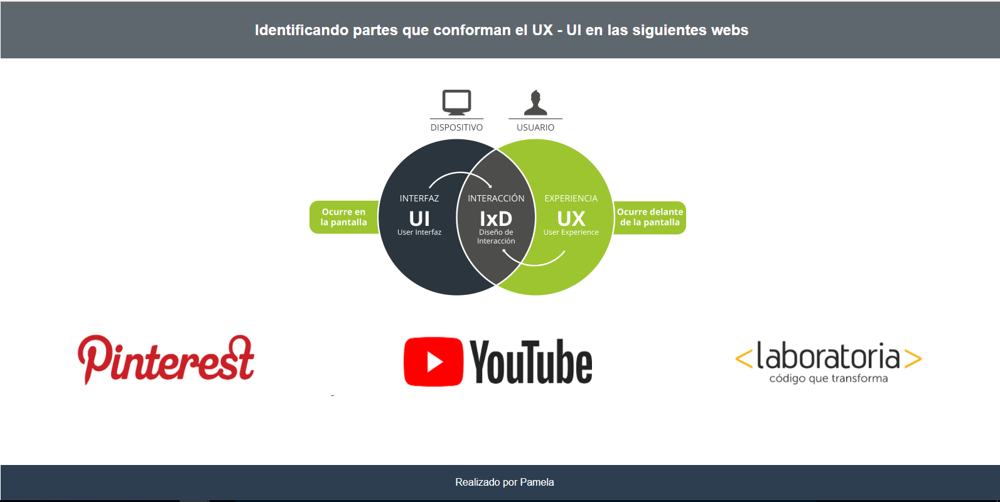

# IDENTIFICANDO PARTES DE UX - UI EN (YOUTUBE/ PINTEREST/ LABORATORIA)

Este repositorio se visualizara la explicación de partes que conforman el UX y UI en los siguientes sites. **(Pinterest, YouTube, Laboratoria)** poniendo en práctica lo aprendido en clases y el self learnig estructuras HTML, hoja de estilo CSS y identificación de UX - UI.

### Herramientas Utilizadas:
1. HTML5
2. CSS3

## PRODUCTO FINAL
Para poder visualizar, debemos acceder al menú principal para que te redireccione a cada uno mediante las imagenes de cada web como: **(Pinterest, YouTube, Laboratoria)**.
